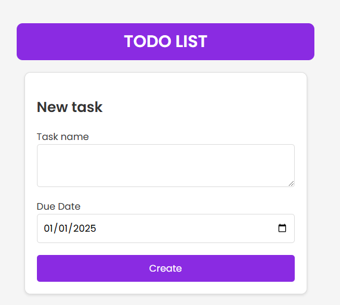

# TODO LIST Application



A modern and simple **TODO LIST** application built with **React** and **Vite**. This application allows users to manage their tasks efficiently, with features such as task creation, deletion, and due date tracking.

## Features

- Add tasks with a title and a due date.
- Automatically assigns "Unnamed Task" for tasks without a title.
- Prevents duplicate task names.
- Clean and modern user interface.
- Built with React for fast and dynamic user experience.
- Powered by Vite for optimized performance during development and production.

## Installation

Follow these steps to set up and run the project locally:

### Prerequisites

Ensure you have the following installed:
- [Node.js](https://nodejs.org/) (version 16+ recommended)
- [Git](https://git-scm.com/)


### Steps:
1. Clone the repository:
  Run the following command to clone the repository:
  ```bash
  git clone https://github.com/hidiegorguez/Todolist
  ```

2. Navigate to the project directory:
Use the following command to move into the project folder:
```bash
cd <project_directory>
```

3. Install dependencies:
Install the required dependencies by running:
```bash
npm install
```

4. Start the development server:
Launch the application locally by running:
```bash
npm run dev
```

Then open your browser and visit http://localhost:5173

5. Build for production:
To generate an optimized build for deployment, use:
```bash
npm run build
```

6. Preview the production build:
  Preview the production build locally using:
```bash
npm run preview
```
